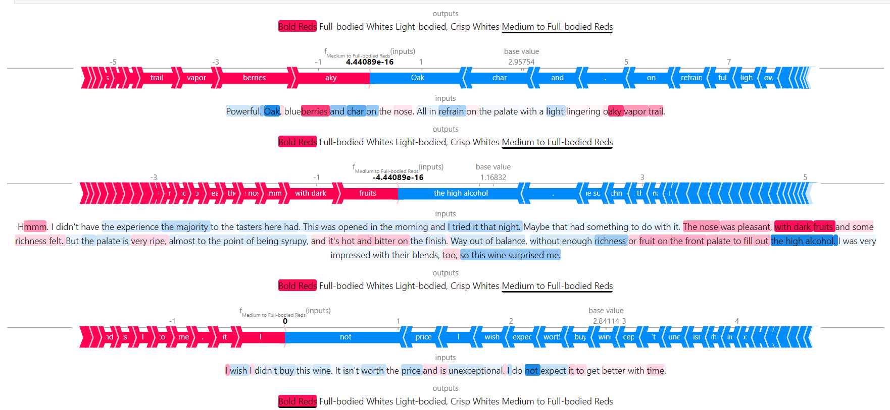

## About Me

Graduate student (*Big Data Analytics and Data Science* at [***San Diego State University***](https://big.sdsu.edu/)) with *3+ years* of professional experience in Data Science. Currently working as a Data Science Research Intern for Automobile Insurance Team at [AAA](https://www.linkedin.com/company/aaa/mycompany/verification/).  Demonstrated competency in utilizing advanced data mining, statistical analysis, and modelling techniques to optimize insights and drive forward business objectives. Applied advanced Machine Learing, Deep Learning and NLP algorithms in various coursework related and personal projects. Seeking to leverage expertise in Python, ML and NLP to uncover actionable insights and gain meaningful experience in data science.

## Skills and Interests:

- **Statistical Computing Language -** Python, R, SAS, STATA
- **Machine Learning Algorithms –**Linear & Logistic Regression, Support Vector Machine, Clustering, Decision Trees, Random Forest, XGBoost
- **Deep Learning (Pytorch) –** CNN, RNN, LSTM , Transformers, LLM
- **Statistical Skills –** Regression, Classification, Clustering, PCA, Time Series, Statistical Testing, Multivariate Statistics
- **Visualization and Reporting –** MS Excel, Tableau, PowerBI
- **Database Querying –** SQL, Snowflake

## News
- **[May. 2024]** Graduate Research Excellence Awarad at SDSU Student Symposium ([Link](https://big.sdsu.edu))

<!--
## Projects

#### Identifying Wine types from Description : Text Classification with LLM and Error Analysis

 Wine reviews used to determine the type of wine training on imbalanced data using classification algorithms like SVM, Naive Bayes and Random Forest Classifier. Neural Network (CNN, RNN and LSTM) and LLM models (DistilBERT and RoBERTa) were also used followed by error analysis using SHAP.

<a href="https://github.com/anurima-saha/Text-Classification" class="btn btn-sm z-depth-0" role="button" target="_blank" style="font-size:12px;">Code</a>
-->


<!--
-->

